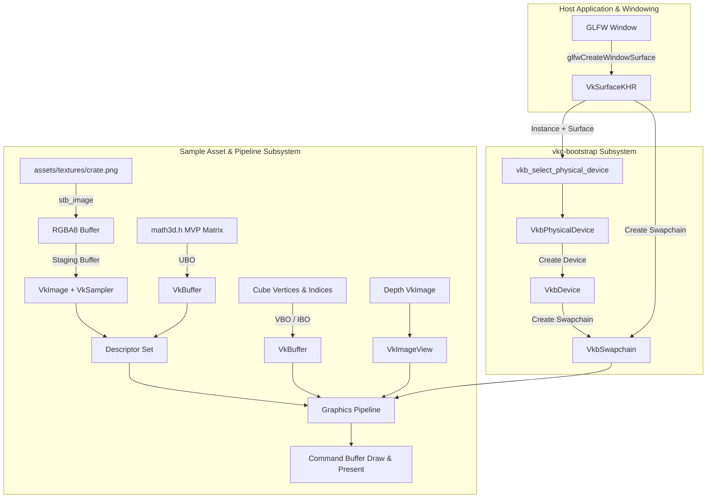

# Requirements

### Overview & Goals
The goal of this phase is to eliminate obsolete placeholder code (`library.c` and `library.h`) and deliver a complete, high-utility **GLFW sample application** in pure C17.
The sample demonstrates the end-to-end integration of `vkc-bootstrap` by initializing Vulkan, creating a window surface via GLFW, configuring devices and swapchains, loading a texture from `assets/textures/crate.png`, and rendering a rotating textured 3D cube with depth testing, dynamic window resize handling, and clean shutdown.

### Scope

#### In Scope
- **Removal of Legacy Files**: Delete obsolete `library.c` and `library.h` files to keep the repository streamlined and focused.
- **Sample Application Target (`textured_cube`)**:
  - GLFW window creation and surface integration.
  - Complete `vkc-bootstrap` setup: Instance, Physical Device selection, Logical Device creation, Swapchain & Image Views creation.
  - Texture loading: Decode `assets/textures/crate.png` via `stb_image`, upload via staging buffer, transition image layout, and sample with linear filtering.
  - 3D Geometry & Math: Define 3D cube vertex positions, UV coordinates, and 36-index buffer; implement C17 matrix math (Perspective, View LookAt, Model rotation, MVP calculation).
  - Depth Buffering: Create depth image, memory, and view to ensure correct 3D occlusion.
  - Graphics Pipeline & Shaders: GLSL/SPIR-V vertex and fragment shaders for textured 3D rendering.
  - Synchronization & Render Loop: Frame synchronization (semaphores and fences), command buffer recording, and presentation.
  - Swapchain Recreation: Responsive window resize handling via `vkb_recreate_swapchain()`.
  - Graceful Resource Teardown: Reverse-order destruction with zero memory or handle leaks.
- **CMake Integration**:
  - Configure `CMakeLists.txt` with `VKC_BOOTSTRAP_BUILD_EXAMPLES` option (default `ON`).
  - Automated retrieval of GLFW (v3.4) and `stb_image` via CMake `FetchContent` to ensure seamless compilation across Clang and MinGW profiles without manual external setup.
- **Documentation**:
  - Update `docs/getting_started.md` and `docs/HANDOFF.md` with instructions on building and running the sample application.

#### Out of Scope
- Complex game engine features (lighting models, audio, scene graphs, physics).
- Third-party UI framework integrations (e.g. Dear ImGui).

### User Stories
- **As a graphics developer**, I want a functional, compilable C17 sample application rendering a textured 3D cube so that I can see concrete, practical usage of `vkc-bootstrap` in a real-world rendering loop.
- **As a developer on Windows/Linux with Clang or MinGW**, I want the sample application to build effortlessly out of the box via CMake without having to manually install or configure system GLFW or image libraries.
- **As a project maintainer**, I want obsolete template files removed so that the repository contains only purposeful, clean code.

### Functional Requirements
1. **File Cleanup**:
   - Safely remove `library.c` and `library.h` from the project repository.
2. **Build Configuration**:
   - Provide `VKC_BOOTSTRAP_BUILD_EXAMPLES` CMake option (default `ON`).
   - Integrate GLFW using CMake `FetchContent` (with fallback to `find_package(glfw3)` if present).
   - Ensure target `textured_cube` links with `vkc_bootstrap`, `glfw`, and Vulkan loader.
3. **Texture Loading & Vulkan Image Management**:
   - Load `assets/textures/crate.png` into RGBA8 pixel memory using `stb_image`.
   - Create Vulkan staging buffer (`VK_BUFFER_USAGE_TRANSFER_SRC_BIT`) and device-local `VkImage` (`VK_IMAGE_USAGE_TRANSFER_DST_BIT | VK_IMAGE_USAGE_SAMPLED_BIT`).
   - Transition image layout (`UNDEFINED` -> `TRANSFER_DST_OPTIMAL` -> `SHADER_READ_ONLY_OPTIMAL`) using a one-time command buffer.
   - Create `VkImageView` and `VkSampler` (with linear filtering and clamp-to-edge/repeat).
4. **3D Geometry & Mathematics**:
   - Define vertex structure `Vertex3D` containing `float pos[3]`, `float normal[3]`, and `float uv[2]`.
   - Provide 24 cube vertices (4 per face) and 36 indices for a complete unit cube.
   - Implement pure C17 matrix math functions in `examples/math3d.h` for 4x4 matrix identity, perspective projection, camera look-at, and rotation.
5. **Vulkan Rendering Pipeline**:
   - Select physical device requiring `samplerAnisotropy` and swapchain support.
   - Create depth attachment image with suitable format (`VK_FORMAT_D32_SFLOAT` or `VK_FORMAT_D24_UNORM_S8_UINT`).
   - Create render pass with color and depth attachments.
   - Create descriptor set layout and pool binding Uniform Buffer (MVP matrix) and Combined Image Sampler (`crate.png`).
   - Create graphics pipeline with backface culling (`VK_CULL_MODE_BACK_BIT`), depth testing, and depth writing enabled.
6. **Swapchain Recreation & Window Resizing**:
   - Handle window minimization (width/height = 0) gracefully by pausing rendering.
   - On window resize event, query new framebuffer size and recreate swapchain, depth buffer, and framebuffers using `vkb_recreate_swapchain()`.
7. **Clean Teardown**:
   - Wait for device idle before destroying resources.
   - Destroy graphics pipeline, descriptors, buffers, images, samplers, swapchain, device, surface, debug messenger, instance, and GLFW window.

### Non-Functional Requirements
- **Standard Conformance**: Strict C17 standard compliance with clean compilation on `-Wall -Wextra -Wpedantic`.
- **Portability**: Tested and verified on Clang (Linux/macOS) and MinGW (Windows).
- **Zero Resource Leaks**: All Vulkan handles, memory allocations, staging buffers, and host pointers released cleanly.
- **Code Clarity**: High utility, readable, self-contained implementation with informative comments explaining each Vulkan step.

# Technical Design

### Current Implementation
The repository currently contains:
- `vkc_bootstrap.h` and `vkc_bootstrap.c`: Complete C17 rewrite of `vk-bootstrap`.
- `assets/textures/crate.png`: 2D crate texture asset for the cube sample.
- `CMakeLists.txt`: Configured for building static library `vkc_bootstrap`.
- `library.c` / `library.h`: Obsolete starter files to be removed.

### Key Decisions
1. **Legacy File Removal**:
   - *Decision*: Delete `library.c` and `library.h`.
   - *Rationale*: Eliminates dead code, avoiding confusion and maximizing codebase clarity.
2. **Automated GLFW & STB Dependency Resolution via FetchContent**:
   - *Decision*: Use CMake `FetchContent` to retrieve official GLFW (v3.4) and STB single-header repository.
   - *Rationale*: Maximizes developer productivity and cross-platform reliability by enabling zero-configuration builds on both Clang and MinGW.
3. **Self-Contained C17 Math Library (`math3d.h`)**:
   - *Decision*: Provide a compact, self-contained 3D math header in `examples/math3d.h` implementing matrix creation, multiplication, perspective projection (Vulkan clip space correction), and rotation.
   - *Rationale*: Avoids heavy external math dependencies while providing maximum transparency and instructional value.
4. **Shaders with Embedded Bytecode and Build-time GLSLC Target**:
   - *Decision*: Provide GLSL shader sources (`cube.vert`, `cube.frag`) along with precompiled SPIR-V C header arrays (`cube_vert_spv.h`, `cube_frag_spv.h`), supplemented with CMake `glslc` recompilation commands when Vulkan SDK tools are present.
   - *Rationale*: Guarantees immediate out-of-the-box compilation even on machines without `glslc` installed, while still supporting shader editing and recompilation.
5. **Depth Buffer Integration**:
   - *Decision*: Add a depth attachment using `VK_FORMAT_D32_SFLOAT` (with fallback to `VK_FORMAT_D24_UNORM_S8_UINT` / `VK_FORMAT_D16_UNORM`).
   - *Rationale*: Required for proper 3D rendering so that occluded back faces of the rotating cube do not overwrite front faces.
6. **Swapchain Recreation Flow**:
   - *Decision*: Use `vkb_recreate_swapchain()` on window resize and `VK_SUBOPTIMAL_KHR` / `VK_ERROR_OUT_OF_DATE_KHR` results.
   - *Rationale*: Demonstrates the swapchain recreation capability of `vkc-bootstrap`.

### Architecture Diagram



### Data Models & Contracts

#### 1. 3D Vertex Definition
```c
typedef struct Vertex3D {
    float pos[3];       /* x, y, z */
    float normal[3];    /* nx, ny, nz */
    float uv[2];        /* u, v */
} Vertex3D;

typedef struct UniformBufferObject {
    mat4 model;
    mat4 view;
    mat4 proj;
} UniformBufferObject;
```

#### 2. Math3D Function Signatures (`examples/math3d.h`)
```c
typedef struct { float m[4][4]; } mat4;
typedef struct { float v[3]; } vec3;

mat4 mat4_identity(void);
mat4 mat4_mul(mat4 a, mat4 b);
mat4 mat4_perspective(float fovy_rad, float aspect, float z_near, float z_far);
mat4 mat4_look_at(vec3 eye, vec3 center, vec3 up);
mat4 mat4_rotate(mat4 m, float angle_rad, vec3 axis);
mat4 mat4_translate(mat4 m, vec3 v);
```

#### 3. Sample Application Architecture (`examples/textured_cube.c`)
- **Initialization Stage**:
  1. Initialize GLFW and create a window with `GLFW_CLIENT_API = GLFW_NO_API`.
  2. Create Vulkan Instance with `vkb_default_instance_info()` + validation layers.
  3. Create GLFW Vulkan window surface.
  4. Select physical device with `vkb_select_physical_device()` (requiring anisotropy and swapchain).
  5. Create logical device with `vkb_create_device()`.
  6. Create swapchain and image views with `vkb_create_swapchain()` and `vkb_swapchain_get_image_views()`.
  7. Create depth buffer image, allocation, and image view.
  8. Create render pass with color and depth attachments.
  9. Create descriptor set layout (binding 0: UBO, binding 1: Sampler).
  10. Create graphics pipeline with shaders, depth test, and backface culling.
  11. Load `assets/textures/crate.png` with `stbi_load()`, stage to `VkImage`, create `VkSampler`.
  12. Create Vertex Buffer and Index Buffer for the 3D cube.
  13. Create Uniform Buffers and Descriptor Pool/Sets.
  14. Create command pool, allocate command buffers, and create sync objects (`VkSemaphore`, `VkFence`).
- **Render Loop**:
  1. Poll GLFW events. Handle minimization.
  2. Wait for fence, acquire next swapchain image index (handle out-of-date).
  3. Update UBO with rotating model matrix (`glfwGetTime()`), view, and perspective projection.
  4. Record command buffer: begin render pass, bind pipeline, bind vertex/index buffers, bind descriptor set, `vkCmdDrawIndexed`, end render pass.
  5. Submit command buffer and present image to swapchain.
- **Teardown**:
  1. `vkDeviceWaitIdle(device.device)`.
  2. Destroy framebuffers, render pass, pipeline, layout, descriptor pool, buffers, texture image/sampler, depth image.
  3. Destroy swapchain image views and swapchain via `vkb_destroy_swapchain()`.
  4. Destroy logical device via `vkb_destroy_device()`.
  5. Destroy surface via `vkDestroySurfaceKHR()`.
  6. Destroy instance via `vkb_destroy_instance()`.
  7. Destroy GLFW window and terminate GLFW.

### File Structure Changes
- **Removed**:
  - `library.c`
  - `library.h`
- **Added / Modified**:
  - `CMakeLists.txt` (updated with FetchContent for GLFW, STB, examples configuration)
  - `examples/textured_cube.c` (main application code)
  - `examples/math3d.h` (C17 3D matrix math library)
  - `examples/stb_image.h` (or STB FetchContent include)
  - `examples/shaders/cube.vert` & `examples/shaders/cube.frag` (GLSL sources)
  - `examples/shaders/cube_vert_spv.h` & `examples/shaders/cube_frag_spv.h` (embedded SPIR-V bytecode headers)
  - `docs/getting_started.md` (updated with sample application build and run section)
  - `docs/HANDOFF.md` (updated with sample integration status)

### Risks & Mitigations
- **Vulkan Coordinate System Differences**:
  - *Risk*: Vulkan NDC Y-axis is inverted relative to OpenGL, which can cause inverted textures or backface culling issues.
  - *Mitigation*: Invert `proj.m[1][1]` in `mat4_perspective` and configure counter-clockwise front-face winding (`VK_FRONT_FACE_COUNTER_CLOCKWISE`).
- **GLFW Availability across Build Profiles**:
  - *Risk*: Host systems running Clang or MinGW may lack system GLFW development libraries.
  - *Mitigation*: Use CMake `FetchContent` to compile GLFW directly from source, ensuring 100% build reliability without pre-installed packages.
- **Missing `glslc` Compiler on Host**:
  - *Risk*: Building machines may not have Vulkan SDK / `glslc` on their system PATH.
  - *Mitigation*: Bundle precompiled SPIR-V C header arrays alongside raw GLSL sources, using CMake conditional logic to rebuild with `glslc` only when available.

# Documentation and Porting Guide

### Overview
This tab specifies the documentation deliverables for the sample application and ongoing codebase maintenance.

### 1. Updated Getting Started Guide (`docs/getting_started.md`)
The guide will include a dedicated walkthrough of the GLFW sample application:
- **Building the Sample**: CMake commands for building with Clang and MinGW.
- **Running the Sample**: Running the `textured_cube` executable and verifying texture rendering.
- **Key Concepts Highlighted**:
  - Connecting `vkc-bootstrap` to GLFW window surfaces.
  - Querying queue family handles.
  - Handling window resize and swapchain recreation.

### 2. Updated Handoff Tracking (`docs/HANDOFF.md`)
Records the completion of legacy file elimination, GLFW sample implementation, verified platforms, and instructions for future feature extensions.

# Testing

### Validation Approach
Verification is performed across both Clang and MinGW compilers to ensure clean builds, strict C17 standard compliance, and correct Vulkan rendering.

### Key Scenarios
1. **Compilation Validation**:
   - Build static library `vkc_bootstrap` and executable `textured_cube` on Clang.
   - Build static library `vkc_bootstrap` and executable `textured_cube` on MinGW.
   - Validate with `-Wall -Wextra -Wpedantic -std=c17`.
2. **Window & Surface Creation**:
   - Verify GLFW window initializes and `glfwCreateWindowSurface` generates a valid `VkSurfaceKHR`.
3. **Texture Loading & Vulkan Upload**:
   - Verify `stbi_load` successfully reads `assets/textures/crate.png` (512x512 or specified dimensions, 4 channels).
   - Verify staging buffer allocation, copy command recording, and layout transitions succeed without validation errors.
4. **Rendering & Depth Occlusion**:
   - Verify the 3D cube rotates smoothly along X and Y axes.
   - Verify depth testing correctly occludes back faces.
   - Verify texture mapping aligns cleanly on all 6 cube faces.
5. **Window Resize Handling**:
   - Verify dragging the window edge recreates the swapchain and updates perspective aspect ratio without flickering or crashing.
   - Verify minimizing the window pauses rendering safely.
6. **Clean Shutdown**:
   - Verify closing the window exits cleanly with zero Vulkan validation layer warnings or memory leaks.

# Delivery Steps

### ✓ Step 1: Remove legacy library stubs and configure CMake for example application
Legacy `library.c` and `library.h` files are removed, and `CMakeLists.txt` is updated with FetchContent for GLFW and example build targets.

- Delete obsolete `library.c` and `library.h` files from the project.
- Update `CMakeLists.txt` with `VKC_BOOTSTRAP_BUILD_EXAMPLES` option (default ON).
- Add FetchContent for GLFW (v3.4) and STB repository (for `stb_image.h`).
- Configure shader compilation target with fallback to embedded SPIR-V byte arrays, and define executable target `textured_cube`.

### ✓ Step 2: Implement 3D math, vertex geometry, and texture loading subsystem
3D cube geometry, matrix math helpers, and texture loading routines are implemented in C17.

- Create `examples/math3d.h` providing 4x4 matrix math (perspective projection with Vulkan Y-flip, camera look-at, translation, rotation, and matrix multiplication) in C17.
- Define 3D cube vertex structure `Vertex3D` (position, normal, UV coordinates) with 24 vertices and 36 indices for a complete unit cube.
- Implement texture loading function using `stb_image` to decode `assets/textures/crate.png` into RGBA8 pixel memory.
- Implement Vulkan buffer and image upload helpers: staging buffer allocation, device-local image allocation, image layout transition to `VK_IMAGE_LAYOUT_SHADER_READ_ONLY_OPTIMAL`, and `VkSampler` creation.

### ✓ Step 3: Implement complete Vulkan rendering pipeline and GLFW main loop
A fully functional GLFW sample application rendering a rotating textured 3D cube with depth testing and swapchain recreation is created.

- Create `examples/textured_cube.c` initializing GLFW window and creating Vulkan window surface.
- Initialize Vulkan subsystem using `vkc-bootstrap`: create instance with debug messenger, select physical device with anisotropy requirement, create logical device with graphics/present queues, and create swapchain with image views.
- Create depth buffer image, memory allocation, and depth image view for 3D occlusion testing.
- Create render pass with color and depth attachments, and framebuffers matching swapchain extent.
- Create descriptor pool, descriptor set layout, and descriptor set binding uniform buffer (MVP) and combined image sampler for `crate.png`.
- Build graphics pipeline with vertex and fragment shaders, backface culling, and depth test/write enabled.
- Implement frame rendering loop with double/triple buffering synchronization (`VkSemaphore`, `VkFence`), rotating MVP calculation, command buffer recording, and presentation.
- Handle framebuffer resize callback gracefully by recreating swapchain and depth buffer with `vkb_recreate_swapchain()`.
- Implement clean, reverse-order resource deallocation on exit.

### ✓ Step 4: Update documentation, build guides, and handoff tracking
Documentation and build guides are updated to describe running and extending the sample application.

- Update `docs/getting_started.md` with instructions on building and running the `textured_cube` sample application.
- Update `docs/HANDOFF.md` recording the completed milestones, GLFW sample integration, and verified profiles.