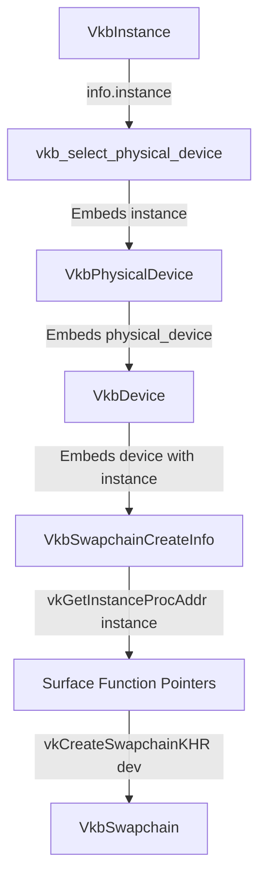

# Requirements

### Overview & Goals
The goal of this task is to fix the swapchain creation failure (`Failed to create swapchain: VKB_ERROR_VULKAN_NOT_AVAILABLE: Vulkan loader or driver not available`) encountered when running the `textured_cube` example application.
The root cause is that `vkb_create_swapchain` passed `VK_NULL_HANDLE` to `vkGetInstanceProcAddr` when resolving instance-level surface extension function pointers (`vkGetPhysicalDeviceSurfaceCapabilitiesKHR`, `vkGetPhysicalDeviceSurfaceFormatsKHR`, `vkGetPhysicalDeviceSurfacePresentModesKHR`), which per Vulkan specification requires a valid `VkInstance` handle.
This change ensures that `VkInstance` is properly retained across `VkbPhysicalDevice`, `VkbDevice`, and `VkbSwapchainCreateInfo`, and used during function pointer resolution so swapchain creation succeeds seamlessly.

### Scope

#### In Scope
- **Instance Handle Propagation**:
  - Update `VkbPhysicalDevice` to store the parent `VkInstance instance` handle.
  - Update `VkbSwapchainCreateInfo` and `VkbSwapchain` to store/forward the `VkInstance` handle.
  - Ensure `vkb_evaluate_physical_device` assigns `out_candidate->physical_device.instance = info->instance`.
  - Ensure `vkb_default_swapchain_info` copies `info.instance = device.physical_device.instance`.
- **Dynamic ProcAddr Resolution in Swapchain Creation**:
  - In `vkb_create_swapchain` (`vkc_bootstrap.c`), retrieve the valid `VkInstance` handle from `info->instance` (or `info->device.physical_device.instance`).
  - Pass the valid `instance` handle to `vkGetInstanceProcAddr` for `vkGetPhysicalDeviceSurfaceCapabilitiesKHR`, `vkGetPhysicalDeviceSurfaceFormatsKHR`, and `vkGetPhysicalDeviceSurfacePresentModesKHR`.
- **Validation and Build Verification**:
  - Verify that the static library `vkc_bootstrap` and the `textured_cube` executable compile cleanly on Clang and GCC.
  - Verify that swapchain creation and swapchain recreation succeed without `VKB_ERROR_VULKAN_NOT_AVAILABLE`.

#### Out of Scope
- Changes to third-party dependencies (GLFW, Vulkan-Headers, STB).
- Modifications to 3D cube geometry, shaders, or matrix mathematics.

### User Stories
- **As a developer using `vkc-bootstrap`**, I want `vkb_create_swapchain` and `vkb_recreate_swapchain` to resolve surface extension function pointers correctly using the active `VkInstance` handle so that swapchain creation succeeds without bogus `VKB_ERROR_VULKAN_NOT_AVAILABLE` errors.
- **As a maintainer**, I want all core structs (`VkbPhysicalDevice`, `VkbDevice`, `VkbSwapchain`) to have consistent parent instance references so that any future instance-level extension queries have direct access to the valid `VkInstance`.

### Functional Requirements
1. **VkbPhysicalDevice Instance Storage**:
   - `VkbPhysicalDevice` struct in `vkc_bootstrap.h` must contain a `VkInstance instance` field.
   - `vkb_evaluate_physical_device` in `vkc_bootstrap.c` must populate `out_candidate->physical_device.instance = info->instance`.
2. **VkbSwapchainCreateInfo and VkbSwapchain Handle Wiring**:
   - `VkbSwapchainCreateInfo` must contain a `VkInstance instance` field.
   - `vkb_default_swapchain_info(device, surface, width, height)` must initialize `info.instance = device.physical_device.instance`.
   - `VkbSwapchain` must contain a `VkInstance instance` field populated upon creation.
3. **Correct `vkGetInstanceProcAddr` Invocations**:
   - `vkb_create_swapchain` must extract `instance = (info->instance != VK_NULL_HANDLE) ? info->instance : info->device.physical_device.instance`.
   - `vkGetInstanceProcAddr(instance, ...)` must be used for:
     - `vkGetPhysicalDeviceSurfaceCapabilitiesKHR`
     - `vkGetPhysicalDeviceSurfaceFormatsKHR`
     - `vkGetPhysicalDeviceSurfacePresentModesKHR`
   - Validate that all required function pointers are non-NULL before proceeding with surface capability evaluation and `vkCreateSwapchainKHR`.

### Non-Functional Requirements
- **Standard Conformance**: Strict C17 standard compliance with zero warnings on `-Wall -Wextra -Wpedantic`.
- **Vulkan Spec Compliance**: Fully conforms to Vulkan loader specification for `vkGetInstanceProcAddr` and `vkGetDeviceProcAddr` dispatching.
- **Zero API Breaking Regressions**: Existing initialization calls remain binary and source compatible.

# Technical Design

### Current Implementation
In `vkc_bootstrap.c` (lines 1201–1214):
```c
PFN_vkGetPhysicalDeviceSurfaceCapabilitiesKHR pfn_get_surface_caps =
    (PFN_vkGetPhysicalDeviceSurfaceCapabilitiesKHR)vkGetInstanceProcAddr(VK_NULL_HANDLE, "vkGetPhysicalDeviceSurfaceCapabilitiesKHR");
PFN_vkGetPhysicalDeviceSurfaceFormatsKHR pfn_get_surface_formats =
    (PFN_vkGetPhysicalDeviceSurfaceFormatsKHR)vkGetInstanceProcAddr(VK_NULL_HANDLE, "vkGetPhysicalDeviceSurfaceFormatsKHR");
PFN_vkGetPhysicalDeviceSurfacePresentModesKHR pfn_get_surface_present_modes =
    (PFN_vkGetPhysicalDeviceSurfacePresentModesKHR)vkGetInstanceProcAddr(VK_NULL_HANDLE, "vkGetPhysicalDeviceSurfacePresentModesKHR");
```
When `VK_NULL_HANDLE` is passed to `vkGetInstanceProcAddr`, the Vulkan loader only dispatches global commands (`vkCreateInstance`, `vkEnumerateInstanceExtensionProperties`, etc.). Surface extension functions are instance-level commands and return `NULL` when passed `VK_NULL_HANDLE`, triggering the guard and returning `VKB_ERROR_VULKAN_NOT_AVAILABLE`.

### Key Decisions
1. **Retain `VkInstance` in `VkbPhysicalDevice` and `VkbSwapchainCreateInfo`**:
   - *Decision*: Add `VkInstance instance;` to `VkbPhysicalDevice`, `VkbSwapchainCreateInfo`, and `VkbSwapchain`.
   - *Rationale*: Vulkan requires `VkInstance` to query instance-level extension functions (such as surface capabilities, formats, and present modes). Retaining the instance handle in `VkbPhysicalDevice` ensures `VkbDevice` (which embeds `VkbPhysicalDevice`) and `VkbSwapchainCreateInfo` (which embeds `VkbDevice`) have uninterrupted access to the parent instance.
2. **Fallback Instance Resolution**:
   - *Decision*: In `vkb_create_swapchain`, determine the instance via `(info->instance != VK_NULL_HANDLE) ? info->instance : info->device.physical_device.instance`.
   - *Rationale*: Guarantees that whether callers initialize via `vkb_default_swapchain_info` or designated initializers, the instance handle is correctly acquired.

### Architecture & Data Flow



### Data Models & Contracts

#### `vkc_bootstrap.h` Updates:
```c
typedef struct VkbPhysicalDevice {
    VkPhysicalDevice physical_device;                   /**< The raw VkPhysicalDevice handle. */
    VkInstance instance;                                /**< Parent Vulkan instance handle. */
    VkSurfaceKHR surface;                               /**< The surface handle used during selection (if any). */
    VkPhysicalDeviceProperties properties;             /**< Physical device properties. */
    VkPhysicalDeviceFeatures features;                 /**< Supported physical device features. */
    VkPhysicalDeviceMemoryProperties memory_properties; /**< Memory budget and heap properties. */
    ...
} VkbPhysicalDevice;

typedef struct VkbSwapchainCreateInfo {
    VkInstance instance;                                /**< Optional explicit Vulkan instance handle (falls back to device.physical_device.instance). */
    VkbDevice device;                                   /**< Logical device handle. */
    VkSurfaceKHR surface;                               /**< Window surface handle. */
    ...
} VkbSwapchainCreateInfo;

typedef struct VkbSwapchain {
    VkSwapchainKHR swapchain;                           /**< Raw VkSwapchainKHR handle. */
    VkDevice device;                                    /**< Logical device the swapchain belongs to. */
    VkInstance instance;                                /**< Parent Vulkan instance handle. */
    VkFormat image_format;                              /**< Selected image format. */
    VkColorSpaceKHR color_space;                        /**< Selected color space. */
    VkExtent2D extent;                                  /**< Clamped and resolved swapchain extent. */
    uint32_t image_count;                               /**< Number of presentable images in the swapchain. */
    const VkAllocationCallbacks* allocation_callbacks;  /**< Stored allocation callbacks for destruction. */
} VkbSwapchain;
```

#### `vkc_bootstrap.c` Updates:
```c
/* In vkb_evaluate_physical_device: */
out_candidate->physical_device.physical_device = pdev;
out_candidate->physical_device.instance = info->instance;
out_candidate->physical_device.surface = info->surface;

/* In vkb_default_swapchain_info: */
info.instance = device.physical_device.instance;
info.device = device;
info.surface = surface;

/* In vkb_create_swapchain: */
VkInstance instance = (info->instance != VK_NULL_HANDLE) ? info->instance : info->device.physical_device.instance;
if (instance == VK_NULL_HANDLE) {
    return VKB_ERROR_INVALID_ARGUMENT;
}

PFN_vkGetPhysicalDeviceSurfaceCapabilitiesKHR pfn_get_surface_caps =
    (PFN_vkGetPhysicalDeviceSurfaceCapabilitiesKHR)vkGetInstanceProcAddr(instance, "vkGetPhysicalDeviceSurfaceCapabilitiesKHR");
PFN_vkGetPhysicalDeviceSurfaceFormatsKHR pfn_get_surface_formats =
    (PFN_vkGetPhysicalDeviceSurfaceFormatsKHR)vkGetInstanceProcAddr(instance, "vkGetPhysicalDeviceSurfaceFormatsKHR");
PFN_vkGetPhysicalDeviceSurfacePresentModesKHR pfn_get_surface_present_modes =
    (PFN_vkGetPhysicalDeviceSurfacePresentModesKHR)vkGetInstanceProcAddr(instance, "vkGetPhysicalDeviceSurfacePresentModesKHR");
```

### Risks & Mitigations
- **Risk**: `info->device.physical_device.instance` might be `VK_NULL_HANDLE` if a user manually constructs `VkbDevice` without setting `instance`.
- **Mitigation**: Allow explicit override in `VkbSwapchainCreateInfo.instance` and validate `instance != VK_NULL_HANDLE`, returning `VKB_ERROR_INVALID_ARGUMENT` if neither is provided.

# Testing

### Validation Approach
Verify that `vkc_bootstrap` static library and `textured_cube` application compile and link without errors, and that swapchain creation resolves all surface extension pointers using the active `VkInstance`.

### Key Scenarios
1. **Compilation Validation**:
   - Recompile `vkc_bootstrap` and `textured_cube` with Clang and GCC using `-std=c17 -Wall -Wextra -Wpedantic`.
2. **Swapchain Creation Resolution**:
   - Verify that `pfn_get_surface_caps`, `pfn_get_surface_formats`, and `pfn_get_surface_present_modes` return valid non-NULL function pointers from `vkGetInstanceProcAddr(instance, ...)`.
   - Verify that `vkb_create_swapchain` returns `VKB_SUCCESS` and populates `out_swapchain` with valid extent, formats, and image count.
3. **Swapchain Recreation on Resize**:
   - Verify `vkb_recreate_swapchain` successfully queries capabilities on window resize and recreates the swapchain with the new dimensions.

# Delivery Steps

### ✓ Step 1: Propagate VkInstance handle in core structs and fix proc address loading
Update `VkbPhysicalDevice`, `VkbSwapchainCreateInfo`, and `VkbSwapchain` in `vkc_bootstrap.h` and fix `vkGetInstanceProcAddr` calls in `vkc_bootstrap.c`.

- Add `VkInstance instance;` field to `VkbPhysicalDevice`, `VkbSwapchainCreateInfo`, and `VkbSwapchain` in `vkc_bootstrap.h`.
- In `vkc_bootstrap.c`, update `vkb_evaluate_physical_device` to store `out_candidate->physical_device.instance = info->instance`.
- In `vkc_bootstrap.c`, update `vkb_default_swapchain_info` to assign `info.instance = device.physical_device.instance`.
- In `vkc_bootstrap.c`, update `vkb_create_swapchain` to resolve `vkGetPhysicalDeviceSurfaceCapabilitiesKHR`, `vkGetPhysicalDeviceSurfaceFormatsKHR`, and `vkGetPhysicalDeviceSurfacePresentModesKHR` using the valid `instance` handle.

### ✓ Step 2: Validate build and verify swapchain creation in example application
Build the project using CMake across Clang and GCC profiles and verify that the example application builds and runs without swapchain errors.

- Run CMake build for `vkc_bootstrap` static library and `textured_cube` executable.
- Verify that `vkb_create_swapchain` and `vkb_recreate_swapchain` return `VKB_SUCCESS`.
- Update `docs/HANDOFF.md` to document the bug fix and status.